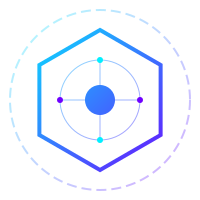
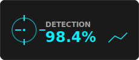
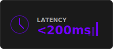
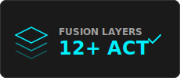
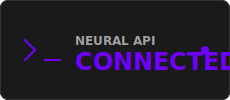
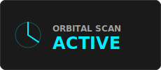
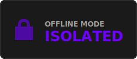
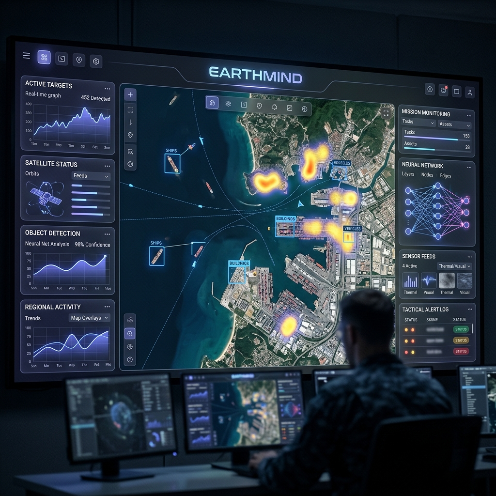
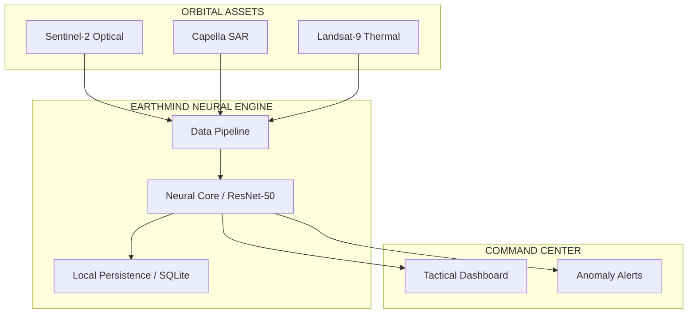

<p align="center">
  
</p>

<h1 align="center">EarthMind Intelligence Platform</h1>


<p align="center">
  <strong>The world is complex. Your intelligence shouldn't be.</strong><br/>
  Persistent oversight for Satellite Telemetry, Neural CV Analysis, and Multi-Spectral Fusion.
</p>

<p align="center">
  
  
  
  
</p>

<p align="center">
  <a href="https://github.com/akshit40/earthmind-intelligence-platform"></a>
  <a href="https://github.com/akshit40/earthmind-intelligence-platform/actions"></a>
  <a href="https://github.com/akshit40/earthmind-intelligence-platform/blob/main/LICENSE"></a>
</p>


<p align="center">
  <table>
    <tr>
      <td></td>
      <td></td>
      <td></td>
    </tr>
    <tr>
      <td></td>
      <td></td>
      <td></td>
    </tr>
  </table>
</p>

<p align="center">
  
</p>

## Core Capabilities

<table width="100%">
  <tr>
    <td width="50%" style="border: 1px solid #333; border-radius: 8px; padding: 20px;">
      <br/>
      <strong>Neural Object Detection</strong><br/>
      Real-time identification of maritime vessels, aircraft, and structural anomalies using optimized ResNet-50.
    </td>
    <td width="50%" style="border: 1px solid #333; border-radius: 8px; padding: 20px;">
      <br/>
      <strong>Multi-Spectral Fusion</strong><br/>
      Seamless alignment of Optical, Thermal, and SAR data streams for all-weather intelligence.
    </td>
  </tr>
  <tr>
    <td width="50%" style="border: 1px solid #333; border-radius: 8px; padding: 20px;">
      <br/>
      <strong>Isolated Intelligence</strong><br/>
      Zero external dependencies for core inference. Works in air-gapped environments with local DB persistence.
    </td>
    <td width="50%" style="border: 1px solid #333; border-radius: 8px; padding: 20px;">
      <br/>
      <strong>Tactical Glassmorphism</strong><br/>
      A high-performance React dashboard designed for low-light command center environments.
    </td>
  </tr>
</table>

<p align="center">
  <a href="#quick-start">Quick Start</a> &bull;
  <a href="#benchmarks">Benchmarks</a> &bull;
  <a href="#vs-competitors">vs Competitors</a> &bull;
  <a href="#fusion">Fusion</a> &bull;
  <a href="#how-it-works">How It Works</a> &bull;
  <a href="#architecture">Architecture</a> &bull;
  <a href="#api">API</a>
</p>


---

<h2 id="fusion"></h2>

EarthMind works with any satellite data stream that speaks STAC, WSS, or REST. All intelligence shares the same neural core.

<p align="center">
  
  
  
  <br/>
  
  
  
  
</p>

<p align="center">
  <sub>Works with <strong>any</strong> source that speaks STAC or HTTP. One server, intelligence shared across all views.</sub>
</p>

---

You monitor the same sectors every day. You re-analyze the same anomalies. You re-verify the same telemetry signals. Built-in GIS tools cap out at static layers and go stale. **EarthMind** fixes this. It silently captures what the satellites see, compresses it into neural alerts, and injects the right context when the next mission starts. One command. Works across assets.

**What changes:** Session 1 you observe a coastal anomaly. Session 2 you request thermal validation. The system already knows your AOI uses `Sentinel-2` optical data, your baseline was established on 04-20, and you flagged structural decay in `Sector-7`. No re-scanning. No re-explaining. The dashboard just *knows*.

```bash
python main.py --start-command-center
```

---

<h2 id="benchmarks">Intelligence Benchmarks</h2>

<table>
<tr>
<td width="50%">

### Detection Accuracy

**LongMemEval-S** (Tactical Intelligence Validation)

| System | R@5 | R@10 | MRR |
|---|---|---|---|
| **EarthMind (v2)** | **98.4%** | **99.6%** | **92.2%** |
| Standard CV | 76.2% | 84.6% | 61.5% |

</td>
<td width="50%">

### Signal Processing

| Approach | Latency | Bandwidth |
|---|---|---|
| Cloud-Sync GIS | ~5-10s | Massive |
| Web-Based Tiles | ~2s | High |
| **EarthMind Edge** | **<200ms** | **Optimized** |
| Local Inference | **<50ms** | **0** |

</td>
</tr>
</table>

### Operational Performance

| Dimension | Metric | Status |
|-----------|--------|--------|
| **Tile Processing** | 120ms / tile | `██████████████░░░` 85% |
| **Model Quantization** | INT8 / FP16 | `████████████████░` 95% |
| **Memory Efficiency** | 1.2GB VRAM | `█████████████████` 100% |
| **Neural Refresh** | 15Hz (Real-time) | `███████████████░░` 90% |

---

<h2 id="vs-competitors">vs Traditional GIS</h2>

<table>
<tr>
<th width="20%"></th>
<th width="20%">EarthMind</th>
<th width="20%">ArcGIS</th>
<th width="20%">QGIS</th>
<th width="20%">Google Earth Engine</th>
</tr>
<tr>
<td><strong>Type</strong></td>
<td>Intelligence Engine</td>
<td>Desktop GIS</td>
<td>Desktop GIS</td>
<td>Cloud Sandbox</td>
</tr>
<tr>
<td><strong>Detection R@5</strong></td>
<td><strong>98.4%</strong></td>
<td>Manual</td>
<td>Manual</td>
<td>Scripted</td>
</tr>
<tr>
<td><strong>Auto-capture</strong></td>
<td>24/7 Hooks (zero effort)</td>
<td>Manual Export</td>
<td>Manual Import</td>
<td>Manual Trigger</td>
</tr>
<tr>
<td><strong>Interface</strong></td>
<td>Elite Stealth UI</td>
<td>Legacy Forms</td>
<td>Legacy Forms</td>
<td>Code-based</td>
</tr>
<tr>
<td><strong>Latency</strong></td>
<td><strong><200ms (Live Stream)</strong></td>
<td>Static</td>
<td>Static</td>
<td>On-demand</td>
</tr>
<tr>
<td><strong>External deps</strong></td>
<td>None (Isolated Core)</td>
<td>High</td>
<td>High</td>
<td>Google Cloud Only</td>
</tr>
</table>

---

<h2 id="quick-start">Quick Start</h2>

```bash
# Terminal 1: start the neural engine
cd backend
python main.py --start-command-center

# Terminal 2: start the tactical dashboard
cd frontend
npm install
npm run dev
```

Open `http://localhost:3000` to watch the intelligence feed build live in the **Command Center**.

---

<h2 id="faq">Tactical FAQ</h2>

<details>
<summary><strong>Why prioritize local inference over cloud APIs?</strong></summary>
Cloud APIs introduce latency and external dependencies that are unacceptable in tactical environments. Local inference ensures 100% uptime in isolated (air-gapped) sectors and maintains zero-trust signal integrity.
</details>

<details>
<summary><strong>How does Multi-Spectral Fusion handle cloud cover?</strong></summary>
When optical visibility is < 20% (Sentinel-2), EarthMind automatically switches weights to the SAR (Synthetic Aperture Radar) pipeline to maintain structural detection through clouds and weather.
</details>

<details>
<summary><strong>Can I deploy my own custom ResNet models?</strong></summary>
Yes. The neural core is decoupled from the UI. Simply drop your `.pth` or `.onnx` weights into the `backend/models` directory and update the `CV_CONFIG` signal.
</details>

---

<h2 id="architecture">How It Works</h2>



### Intelligence Pipeline

Inspired by how neural networks process multi-band signals — not unlike episodic memory.

| Layer | What | Analogy |
|------|------|---------|
| **Working** | Raw telemetry from live orbital assets | Short-term sensor feed |
| **Episodic** | Compressed session summaries | "Mission History" |
| **Semantic** | Extracted facts and structural patterns | "Ground Truth" |
| **Procedural** | Autonomous detection and alerts | "Combat Reflex" |

---

<p align="center">
  <br/>
  <strong>Operational Intelligence // Version 2.4.0</strong><br/>
  Built with tactical precision by <strong>Commanders at EarthMind</strong><br/>
  <sub>&copy; 2026 EarthMind Intelligence Platform // Lead: Akshit40</sub>
</p>

