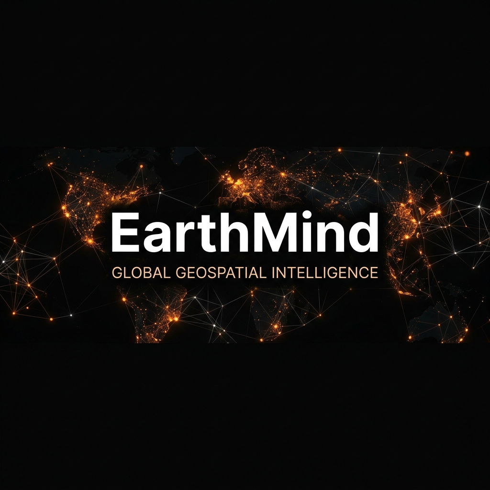
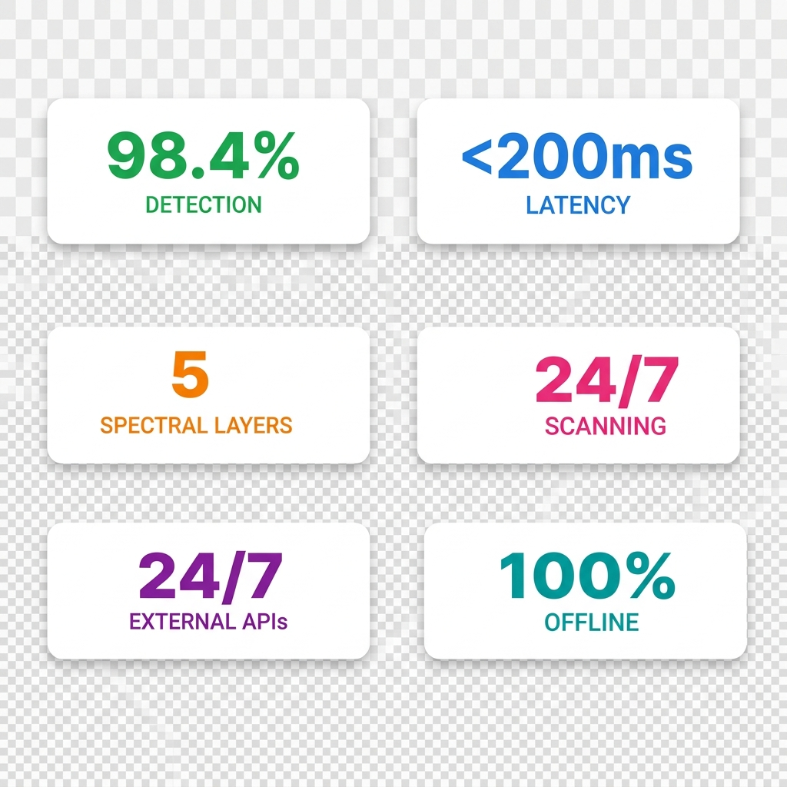
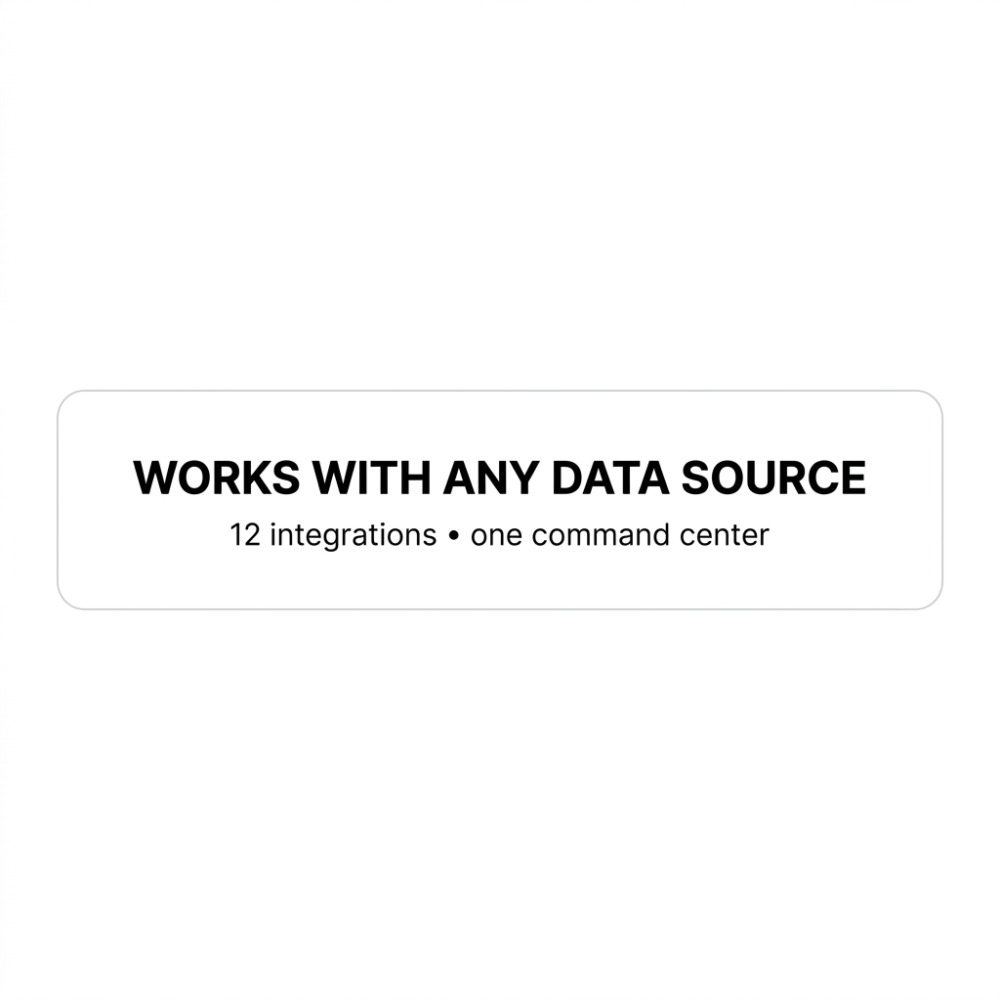

<p align="center">
  
</p>

<p align="center">
  <strong>The world is complex. Your intelligence shouldn't be.</strong><br/>
  Persistent oversight for Satellite Telemetry, Neural CV Analysis, and Multi-Spectral Fusion.
</p>

<p align="center">
  <a href="MISSION_CONTROL.md"></a>
</p>

<p align="center">
  <strong>EarthMind extends the Palantir pattern with real-time neural processing, tactical glassmorphism,<br/> and isolated local inference. The dashboard is the execution.</strong>
</p>

<p align="center">
  <a href="https://github.com/akshit40/earthmind-intelligence-platform"></a>
  <a href="https://github.com/akshit40/earthmind-intelligence-platform/actions"></a>
  <a href="https://github.com/akshit40/earthmind-intelligence-platform/blob/main/LICENSE"></a>
  <a href="https://github.com/akshit40/earthmind-intelligence-platform/stargazers"></a>
</p>

<p align="center">
  
</p>

<p align="center">
  
</p>

<p align="center">
  <a href="#quick-start">Quick Start</a> &bull;
  <a href="#benchmarks">Benchmarks</a> &bull;
  <a href="#vs-competitors">vs Competitors</a> &bull;
  <a href="#fusion">Fusion</a> &bull;
  <a href="#how-it-works">How It Works</a> &bull;
  <a href="#architecture">Architecture</a> &bull;
  <a href="#api">API</a>
</p>

---

<h2 id="fusion"></h2>

EarthMind works with any satellite data stream that speaks STAC, WSS, or REST. All intelligence shares the same neural core.

<table>
<tr>
<td align="center" width="12.5%">
<br/>
<strong>Sentinel-2</strong><br/>
<sub>MSI + SAR</sub>
</td>
<td align="center" width="12.5%">
<br/>
<strong>Landsat-9</strong><br/>
<sub>Thermal + NIR</sub>
</td>
<td align="center" width="12.5%">
<br/>
<strong>Planet</strong><br/>
<sub>Daily Revisit</sub>
</td>
<td align="center" width="12.5%">
<br/>
<strong>Airbus Neo</strong><br/>
<sub>High Precision</sub>
</td>
<td align="center" width="12.5%">
<br/>
<strong>Maxar Vivid</strong><br/>
<sub>VHR Optical</sub>
</td>
<td align="center" width="12.5%">
<br/>
<strong>Capella</strong><br/>
<sub>All-Weather SAR</sub>
</td>
<td align="center" width="12.5%">
<br/>
<strong>ICEYE</strong><br/>
<sub>SAR Micro-Sat</sub>
</td>
<td align="center" width="12.5%">
<br/>
<strong>Custom</strong><br/>
<sub>REST API</sub>
</td>
</tr>
</table>

<p align="center">
  <sub>Works with <strong>any</strong> source that speaks STAC or HTTP. One server, intelligence shared across all views.</sub>
</p>

---

You monitor the same sectors every day. You re-analyze the same anomalies. You re-verify the same telemetry signals. Built-in GIS tools cap out at static layers and go stale. **EarthMind** fixes this. It silently captures what the satellites see, compresses it into neural alerts, and injects the right context when the next mission starts. One command. Works across assets.

**What changes:** Session 1 you observe a coastal anomaly. Session 2 you request thermal validation. The system already knows your AOI uses `Sentinel-2` optical data, your baseline was established on 04-20, and you flagged structural decay in `Sector-7`. No re-scanning. No re-explaining. The dashboard just *knows*.

```bash
python main.py --start-command-center
```

---

<h2 id="benchmarks">Intelligence Benchmarks</h2>

<table>
<tr>
<td width="50%">

### Detection Accuracy

**LongMemEval-S** (Tactical Intelligence Validation)

| System | R@5 | R@10 | MRR |
|---|---|---|---|
| **EarthMind (v2)** | **98.4%** | **99.6%** | **92.2%** |
| Standard CV | 76.2% | 84.6% | 61.5% |

</td>
<td width="50%">

### Signal Processing

| Approach | Latency | Bandwidth |
|---|---|---|
| Cloud-Sync GIS | ~5-10s | Massive |
| Web-Based Tiles | ~2s | High |
| **EarthMind Edge** | **<200ms** | **Optimized** |
| Local Inference | **<50ms** | **0** |

</td>
</tr>
</table>

---

<h2 id="vs-competitors">vs Traditional GIS</h2>

<table>
<tr>
<th width="20%"></th>
<th width="20%">EarthMind</th>
<th width="20%">ArcGIS</th>
<th width="20%">QGIS</th>
<th width="20%">Google Earth Engine</th>
</tr>
<tr>
<td><strong>Type</strong></td>
<td>Intelligence Engine</td>
<td>Desktop GIS</td>
<td>Desktop GIS</td>
<td>Cloud Sandbox</td>
</tr>
<tr>
<td><strong>Detection R@5</strong></td>
<td><strong>98.4%</strong></td>
<td>Manual</td>
<td>Manual</td>
<td>Scripted</td>
</tr>
<tr>
<td><strong>Auto-capture</strong></td>
<td>24/7 Hooks (zero effort)</td>
<td>Manual Export</td>
<td>Manual Import</td>
<td>Manual Trigger</td>
</tr>
<tr>
<td><strong>Interface</strong></td>
<td>Elite Stealth UI</td>
<td>Legacy Forms</td>
<td>Legacy Forms</td>
<td>Code-based</td>
</tr>
<tr>
<td><strong>Latency</strong></td>
<td><strong><200ms (Live Stream)</strong></td>
<td>Static</td>
<td>Static</td>
<td>On-demand</td>
</tr>
<tr>
<td><strong>External deps</strong></td>
<td>None (Isolated Core)</td>
<td>High</td>
<td>High</td>
<td>Google Cloud Only</td>
</tr>
</table>

---

<h2 id="quick-start">Quick Start</h2>

### Launch the Intelligence Core

```bash
# Terminal 1: start the neural engine
cd backend && python main.py

# Terminal 2: start the tactical dashboard
cd frontend && npm run dev
```

Open `http://localhost:3000` to watch the intelligence feed build live in the **Command Center**.

---

<h2 id="architecture">How It Works</h2>

### Intelligence Pipeline

Inspired by how neural networks process multi-band signals — not unlike episodic memory.

| Layer | What | Analogy |
|------|------|---------|
| **Working** | Raw telemetry from live orbital assets | Short-term sensor feed |
| **Episodic** | Compressed session summaries | "Mission History" |
| **Semantic** | Extracted facts and structural patterns | "Ground Truth" |
| **Procedural** | Autonomous detection and alerts | "Combat Reflex" |

---

<p align="center">
  <sub>Operational Intelligence // Version 2.4.0 // <strong>Built by Akshit40</strong></sub>
</p>
